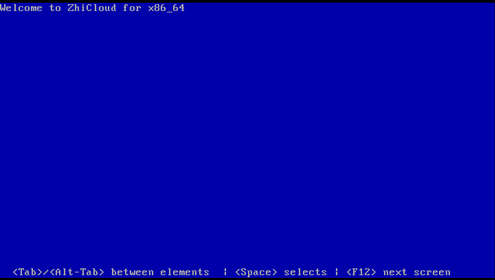
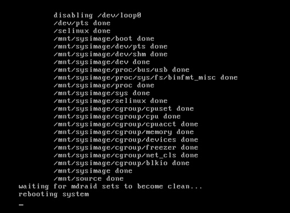
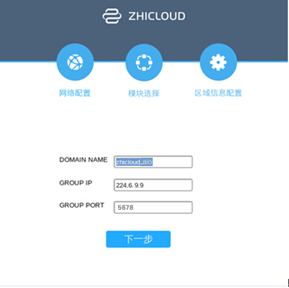
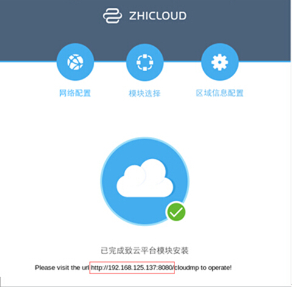

#　　　　all in one quick install
　　　　　　　　　　　　　　　　　　　　　　　　　　　　　　　　　　　　　　　　　　　　　　　　

本文档用于帮助新用户，在私有云解决方案下，搭建all in one情况下的致云云管理平台。  
致云云管理平台总共包含7个区分功能的模块。它们协同工作，为你提供高可靠、高弹性的Iaas云环境。在私有云解决方案下，除了根据需求选择需要安装的平台模块外，还需要选择模块如何分布于服务器。All in one主要用于云管理平台功能演示，它将所有的平台模块安装在一台服务器上。 

　　　　　　　　　　　　　　　　　　　　　　　　　　　　　　　　　　　　　　　　　　
　　　　　　　　　　　　　　　　　　　　　　　　　　　　　　　　　　　　　　　
　　　　　　　　　　　　　　　　　　　　　　　　　　　　　　　　　　　　　
　　　　　　　　　　　　　　　　　　　　　　　　　　　　　　　　　　　　　　
　　　　　　　　　　　　　　　　　　　　　　　　　　　　　　　　　　　　　
　　　　　　　　　　　　　　　　　　　　　　　　　　　　　　　　　　　　　　
　　　　　　　　　　　　　　　　　　　　　　　　　　　　　　　　　　　
　　　　　　　　　　　　　　　　　　　　　　　　　　　　　　　　　　　　　　　　　　　　
　　　　　　　　　　　　　　　　　　　　　　　　　　　　　　　　　　　　　　　　
　　　　　　　　　　　　　　　　　　　　　　　　　　　　　　　　　　　　　　　　　　　　　
　　　　　　　　　　　　　　　　　　　　　　　　　　　　　　　　　　　　　　　　　
　　　　　　　　　　　　　　　　　　　　　　　　　　　　　　　　　　　　　　　　　　　　　　
　　　　　　　　　　　　　　　　　　　　　　　　　　　　　　　　　　　　　　　　　　　　
　　　　　　　　　　　　　　　　　　　　　　　　　　　　　　　　　　　　　　　　
　　　　　　　　　　　　　　　　　　　　　　　　　　　　　　　　　　　　　　　　　　　
　　　　　　　　　　　　　　　　　　　　　　　　　　　　　　　　　　　　　　　　　
　　　　　　　　　　　　　　　　　　　　　　　　　　　　　　　　　　　　　　　　
　　　　　　　　　　　　　　　　　　　　　　　　　　　　　　　　　　　　　　　　　
　　　　　　　　　　　　　　　　　　　　　　　　　　　　　　　　　　　　　　　　　　
　　　　　　　　　　　　　　　　　　　　　　　　　　　　　　　　　　　　　　　　　　　　
　　　　　　　　　　　　　　　　　　　　　　　　　　　　　　　　　　　　　　　　　　
　　　　　　　　　　　　　　　　　　　　　　　　　　　　　　　　　　　　　　　　　　　
　　　　　　　　　　　　　　　　　　　　　　　　　　　　　　　　　　　　　　　　
　　　　　　　　　　　　　　　　　　　　　　　　　　　　　　　　　　　　　　　　
　　　　　　　　　　　　　　　　　　　　　　　　　　　　　　　　　　　　　　　　　　　　
　　　　　　　　　　　　　　　　　　　　　　　　　　　　　　　　　　　　　　　　　　　
　　　　　　　　　　　　　　　　　　　　　　　　　　　　　　　　　　
　　　　　　　　　　　　　　　　　　　　　　　　　　　　　　　　　　　　　　　　　　　　　
　　　　　　　　　　　　　　　　　　　　　　　　　　　　　　　　　　　　　　　　　　　
　　　　　　　　　　　　　　　　　　　　　　　　　　　　　　　　　　　　　　　　　　　　
　　　　　　　　　　　　　　　　　　　　　　　　　　　　　　　　　　　　　　　　　
　　　　　　　　　　　　　　　　　　　　　　　　　　　　　　　　　　　　　　　　
　　　　　　　　　　　　　　　　　　　　　　　　　　　　　　　　　　　　　　　　　　　　
　　　　　　　　　　　　　　　　　　　　　　　　　　　　　　　　　　　　　　　　　　　　　　　　　　　　
## 安装准备
　　　　　　　　　　　　　　　　　　　　　　　　　　　　　　　　　　　　　　　　　　　　　　　　

请准备一台物理服务器，其具体的硬件配置说明详见附录1。  
请准备安装工具：致云云管理平台安装盘或者致云云管理平台的安装ISO镜像文件。
可以通过以下三种途径来安装致云云管理平台。
 
- **光驱**
- USB
- BMC

### 光驱

在服务器上插入云管理平台安装光盘，在服务器启动时选择从光驱启动。
### USB

在服务器上插入存储了云管理平台安装ISO镜像文件的USB,在服务器启动时选择从USB启动。　
### BMC

通过服务器BMC地址，输入账号密码进入服务器管理界面。通过java控制台远程控制服务器。从本地选择致云云管理平台的安装ISO镜像文件加载光驱。
　　　　　　　　　　　　　　　　　　　　　　　　　　　　　　　　　　　　　　　　　　　
　　　　　　　　　　　　　　　　　　　　　　　　　　　　　　　　　　　　　　　　　
　　　　　　　　　　　　　　　　　　　　　　　　　　　　　　　　　　　　　　　　
　　　　　　　　　　　　　　　　　　　　　　　　　　　　　　　　　　　　　　　
　　　　　　　　　　　　　　　　　　　　　　　　　　　　　　　　　　　　　　　
　　　　　　　　　　　　　　　　　　　　　　　　　　　　　　　　　　　　　　　　　
　　　　　　　　　　　　　　　　　　　　　　　　　　　　　　　　　　　　　　　　　　　
　　　　　　　　　　　　　　　　　　　　　　　　　　　　　　　　　　　　　　　　　
　　　　　　　　　　　　　　　　　　　　　　　　　　　　　　　　　　　　　　　　　　　
　　　　　　　　　　　　　　　　　　　　　　　　　　　　　　　　　　　　　　　　　　　
　　　　　　　　　　　　　　　　　　　　　　　　　　　　　　　　　　　　　　　　　
　　　　　　　　　　　　　　　　　　　　　　　　　　　　　　　　　　　　　　　　　　　　
　　　　　　　　　　　　　　　　　　　　　　　　　　　　　　　　　　　　　　　　
　　　　　　　　　　　　　　　　　　　　　　　　　　　　　　　　　　　　　　　　　　
　　　　　　　　　　　　　　　　　　　　　　　　　　　　　　　　　　　　　　　　　
　　　　　　　　　　　　　　　　　　　　　　　　　　　　　　　　　　　　　　　　
　　　　　　　　　　　　　　　　　　　　　　　　　　　　　　　　　　　　　　　　
　　　　　　　　　　　　　　　　　　　　　　　　　　　　　　　　　　　　　　　　　
　　　　　　　　　　　　　　　　　　　　　　　　　　　　　　　　　　　　　　　　　
　　　　　　　　　　　　　　　　　　　　　　　　　　　　　　　　　　　　　　　　　　　

## 安装流程
　　　　　　　　　　　　　　　　　　　　　　　　　　　　　　　　　　　　　　　　　　

安装流程分为以下4步:

1. 基准系统安装
2. 配置服务器网络信息
3. 配置通信域信息
4. 安装完成

　　　　　　　　　　　　　　　　　　　　　　　　　　　　　　　　　　　　　　　　　　
　　　　　　　　　　　　　　　　　　　　　　　　　　　　　　　　　　　　　　　
　　　　　　　　　　　　　　　　　　　　　　　　　　　　　　　　　　　　　　　　
　　　　　　　　　　　　　　　　　　　　　　　　　　　　　　　　　　　　　　　　　
　　　　　　　　　　　　　　　　　　　　　　　　　　　　　　　　　　　　　　　　　　　　　
　　　　　　　　　　　　　　　　　　　　　　　　　　　　　　　　　　　　　　　　
　　　　　　　　　　　　　　　　　　　　　　　　　　　　　　　　　　　　　　　　　　　　　　　　
　　　　　　　　　　　　　　　　　　　　　　　　　　　　　　　　　　　　　　　　　　　　　
　　　　　　　　　　　　　　　　　　　　　　　　　　　　　　　　　　　　　　　　　　　　　　　　
　　　　　　　　　　　　　　　　　　　　　　　　　　　　　　　　　　　　　　　　　
　　　　　　　　　　　　　　　　　　　　　　　　　　　　　　　　　　　　　　　　　　
　　　　　　　　　　　　　　　　　　　　　　　　　　　　　　　　　　　　　　　　　　　　　　　　　
　　　　　　　　　　　　　　　　　　　　　　　　　　　　　　　　　　　　　　　　　　　　　　　
　　　　　　　　　　　　　　　　　　　　　　　　　　　　　　　　　　　　　　　　　
　　　　　　　　　　　　　　　　　　　　　　　　　　　　　　　　　　　　　　　　　　　
　　　　　　　　　　　　　　　　　　　　　　　　　　　　　　　　　　　　　　　　　　　
　　　　　　　　　　　　　　　　　　　　　　　　　　　　　　　　　　　　　　　　　　　　
　　　　　　　　　　　　　　　　　　　　　　　　　　　　　　　　　　　　　　　　　　　　　　　　
　　　　　　　　　　　　　　　　　　　　　　　　　　　　　　　　　　　　　　　　　　　　　　　　　　　　　　　　　　　　　　　　　　　　
　　　　　　　　　　　　　　　　　　　　　　　　　　　　　　　　　　　　　　　　　　　
　　　　　　　　　　　　　　　　　　　　　　　　　　　　　　　　　　　　　　　　　　
　　　　　　　　　　　　　　　　　　　　　　　　　　　　　　　　　　　　　　　　　　
　　　　　　　　　　　　　　　　　　　　　　　　　　　　　　　　　　　　　　　　　　　　　
　　　　　　　　　　　　　　　　　　　　　　　　　　　　　　　　　　　　　　　
　　　　　　　　　　　　　　　　　　　　　　　　　　　　　　　　　　　　　　　　　
　　　　　　　　　　　　　　　　　　　　　　　　　　　　　　　　　　　　　　　
　　　　　　　　　　　　　　　　　　　　　　　　　　　　　　　　　　　　　　　　
　　　　　　　　　　　　　　　　　　　　　　　　　　　　　　　　　　　　　　　　　
　　　　　　　　　　　　　　　　　　　　　　　　　　　　　　　　　　　　　　　　　　
　　　　　　　　　　　　　　　　　　　　　　　　　　　　　　　　　　　　　　　　　　　　
　　　　　　　　　　　　　　　　　　　　　　　　　　　　　　　　　　　　　　　　　　　
　　　　　　　　　　　　　　　　　　　　　　　　　　　　　　　　　　　　　　　　
　　　　　　　　　　　　　　　　　　　　　　　　　　　　　　　　　　　　　　　
　　　　　　　　　　　　　　　　　　　　　　　　　　　　　　　　　　　　　　　　　

### 基准系统安装

当你通过以上任意一种方式进行安装，进入以下界面后，点击回车，开始安装由致云定制的操作系统。

以上过程持续约20分钟，请你耐心等待。  
基准系统安装完毕后服务器会自动重启。
重启后的系统默认的用户名和密码是root/123456

  
  
  
  
　　　　　　　　　　　　　　　　　　　　　　　　　　　　　　　　　　　　　　　　　　　　　　　　
　　　　　　　　　　　　　　　　　　　　　　　　　　　　　　　　　　　　　　　　　
　　　　　　　　　　　　　　　　　　　　　　　　　　　　　　　　　　　　　　
　　　　　　　　　　　　　　　　　　　　　　　　　　　　　　　　　　　　　　　　　　　　
　　　　　　　　　　　　　　　　　　　　　　　　　　　　　　　　　　　　　　　　　　
　　　　　　　　　　　　　　　　　　　　　　　　　　　　　　　　　　　　　　　　
　　　　　　　　　　　　　　　　　　　　　　　　　　　　　　　　　　　　　　　　　　　　
　　　　　　　　　　　　　　　　　　　　　　　　　　　　　　　　　　　　　　　　　
　　　　　　　　　　　　　　　　　　　　　　　　　　　　　　　　　　　　　　　　　　
　　　　　　　　　　　　　　　　　　　　　　　　　　　　　　　　　　　　　　　　　　　
　　　　　　　　　　　　　　　　　　　　　　　　　　　　　　　　　　　　　　　　　　　

### 配置服务器网络信息

首先需要配置服务器的网络信息，网络信息包括：IP地址、子网掩码、默认网关和DNS地址。  
可以通过手动设置或DHCP自动获取两种方式来配置服务器网络信息。默认使用DHCP自动获取的方式。

　　　　　　　　　　　　　　　　　　　　　　　　　　　　　　　　　　　　　　　　　
　　　　　　　　　　　　　　　　　　　　　　　　　　　　　　　　　　　　　　　
　　　　　　　　　　　　　　　　　　　　　　　　　　　　　　　　　　　　　　　　　
　　　　　　　　　　　　　　　　　　　　　　　　　　　　　　　　　　　　　　　　
　　　　　　　　　　　　　　　　　　　　　　　　　　　　　　　　　　　　　　　
　　　　　　　　　　　　　　　　　　　　　　　　　　　　　　　　　　　　　　　　
　　　　　　　　　　　　　　　　　　　　　　　　　　　　　　　　　　　　　　　　　
　　　　　　　　　　　　　　　　　　　　　　　　　　　　　　　　　　　　　　　　
　　　　　　　　　　　　　　　　　　　　　　　　　　　　　　　　　　　　　　
　　　　　　　　　　　　　　　　　　　　　　　　　　　　　　　　　　　　　　　　
　　　　　　　　　　　　　　　　　　　　　　　　　　　　　　　　　　　　　　　　
　　　　　　　　　　　　　　　　　　　　　　　　　　　　　　　　　　　　　　　　　
　　　　　　　　　　　　　　　　　　　　　　　　　　　　　　　　　　　　　　
　　　　　　　　　　　　　　　　　　　　　　　　　　　　　　　　　　　　　　　　　　　　
　　　　　　　　　　　　　　　　　　　　　　　　　　　　　　　　　　　　　　　　　　　
　　　　　　　　　　　　　　　　　　　　　　　　　　　　　　　　　　　　　　　　　　
　　　　　　　　　　　　　　　　　　　　　　　　　　　　　　　　　　　　　
　　　　　　　　　　　　　　　　　　　　　　　　　　　　　　　　　　　　　　　　　　

### 配置通信域信息

致云云管理平台中的各个模块以通信域的方式工作。在同一通信域下的各个模块可以相互通信，进而协同工作。通信域由域名、组播地址和组播端口来标识。注册到同一通信域下的各模块自动识别，构成一套完整的平台。  
请确定服务器上安装的平台模块所属的通信域。通信域默认域名domain name为zhicloud_aio，默认组播地址group ip为224.6.9.9，默认组播端口group port为5678。建议使用默认信息。

　　　　　　　　　　　　　　　　　　　　　　　　　　　　　　　　　　　　　　
　　　　　　　　　　　　　　　　　　　　　　　　　　　　　　　　　　　　　　　
　　　　　　　　　　　　　　　　　　　　　　　　　　　　　　　　　　　　　　
　　　　　　　　　　　　　　　　　　　　　　　　　　　　　　　　　　　　　　　　　　　　
　　　　　　　　　　　　　　　　　　　　　　　　　　　　　　　　　　　　　　　
　　　　　　　　　　　　　　　　　　　　　　　　　　　　　　　　　　　　　
　　　　　　　　　　　　　　　　　　　　　　　　　　　　　　　　　　　　　
　　　　　　　　　　　　　　　　　　　　　　　　　　　　　　　　　　　　　
　　　　　　　　　　　　　　　　　　　　　　　　　　　　　　　　　　　　　　
　　　　　　　　　　　　　　　　　　　　　　　　　　　　　　　　　　　　　　　
　　　　　　　　　　　　　　　　　　　　　　　　　　　　　　　　　　　　　　　
　　　　　　　　　　　　　　　　　　　　　　　　　　　　　　　　　　　　　　　
　　　　　　　　　　　　　　　　　　　　　　　　　　　　　　　　　　　　　
　　　　　　　　　　　　　　　　　　　　　　　　　　　　　　　　　　　　　　　
　　　　　　　　　　　　　　　　　　　　　　　　　　　　　　　　　　　　　　
　　　　　　　　　　　　　　　　　　　　　　　　　　　　　　　　　　　　　　　　　

### 安装完成

出现以下页面时，云平台模块已经安装完成并且自动启动。在多台服务器分别安装成功后，你已经成功搭建了一台属于你的致云云管理平台。  
请根据页面中提示的云平台web管理端的IP地址和端口（图中http://192.168.125.137:8080），使用默认用户名密码（superadmin/superadmin）登陆网页后，使用云管理平台。

　　　　　　　　　　　　　　　　　　　　　　　　　　　　　　　　　　　　　　　　　
　　　　　　　　　　　　　　　　　　　　　　　　　　　　　　　　　　　　　　　　
　　　　　　　　　　　　　　　　　　　　　　　　　　　　　　　　　　　　　　　
　　　　　　　　　　　　　　　　　　　　　　　　　　　　　　　　　　　　　　
　　　　　　　　　　　　　　　　　　　　　　　　　　　　　　　　　　　　　　　
　　　　　　　　　　　　　　　　　　　　　　　　　　　　　　　　　　　　　　
　　　　　　　　　　　　　　　　　　　　　　　　　　　　　　　　　　　　　　　　　　
　　　　　　　　　　　　　　　　　　　　　　　　　　　　　　　　　　　　　　　　
　　　　　　　　　　　　　　　　　　　　　　　　　　　　　　　　　　　　　　　
　　　　　　　　　　　　　　　　　　　　　　　　　　　　　　　　　　　　　　　
　　　　　　　　　　　　　　　　　　　　　　　　　　　　　　　　　　　　　　　
　　　　　　　　　　　　　　　　　　　　　　　　　　　　　　　　　　　　　
　　　　　　　　　　　　　　　　　　　　　　　　　　　　　　　　　　　　　　　
　　　　　　　　　　　　　　　　　　　　　　　　　　　　　　　　　　　　　　
　　　　　　　　　　　　　　　　　　　　　　　　　　　　　　　　　　　　　　
　　　　　　　　　　　　　　　　　　　　　　　　　　　　　　　　　　　　　　　　
　　　　　　　　　　　　　　　　　　　　　　　　　　　　　　　　　　　　　　　　　

# 附录1 服务器硬件配置说明　　　　　
<table>
<tbody>
<tr><td>配置项</td><td>最低配置</td><td>推荐配置</td></tr>
<tr><td>cpu</td><td>12</td><td>24</td></tr>
<tr><td>内存</td><td>48G</td><td>96G</td></tr>
<tr><td>磁盘</td><td>2T</td><td>4T</td></tr>
<tr><td>网卡</td><td>1000M*2</td><td>1000M*4</td></tr>

　　　　　　　　　　　　　　　　　　　　　　　　　　　　　　　　　　　　　　　　　　　　　
　　　　　　　　　　　　　　　　　　　　　　　　　　　　　　　　　　　　　　　
　　　　　　　　　　　　　
　　　　　　　　　　　　　　　　　　　　　　

